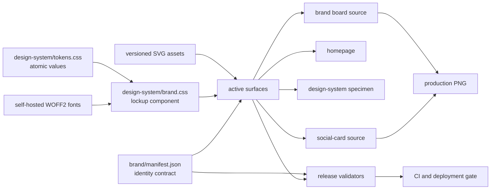

# Openly Useful Brand-System Architecture

Version: **3.0.0**

Status: production contract

## Requirements

### Functional

- Render the same institutional symbol, wordmark, and tagline treatment on the homepage, design-system specimen, brand board, social card, favicon, and footer.
- Support two compositions only: `stacked` for identity moments and `horizontal` for navigation/footer contexts.
- Support light and reverse color treatments without changing geometry or typography.
- Keep old public asset URLs working while preventing old visuals from remaining active.

### Non-functional

- Zero client-side JavaScript required for identity rendering.
- No third-party font request, tracking request, or runtime dependency.
- Deterministic rendering across operating systems through self-hosted WOFF2 fonts.
- Versioned asset URLs for cache safety.
- Automated failure when an active surface references a legacy asset or redefines the lockup.
- WCAG 2.2 AA-compatible semantics, contrast, reflow, and non-text alternatives.

### Constraints

- The site is a dependency-free static site deployed on Vercel.
- The approved O/U SVG geometry remains unchanged.
- The approved board remains the proportional source for the stacked lockup.

## High-level design



## Component boundaries

| Component | Owns | Must not own |
|---|---|---|
| `brand/manifest.json` | Canonical name, tagline, version, asset routes, allowed lockup contexts | Presentation CSS |
| `design-system/tokens.css` | Brand typography, tracking, scale, color, spacing values | Surface layout |
| `design-system/brand.css` | Lockup compositions and typography application | Homepage or board-specific layout |
| Versioned SVGs | Symbol geometry and color treatment | Wordmark typography |
| Surface styles | Page composition around a lockup | Wordmark weight/tracking or internal lockup spacing |
| Validators | Contract enforcement and migration redirects | Visual design decisions |

## Public component contract

### Horizontal lockup

Use only for site headers and footers.

```html
<a class="ou-lockup ou-lockup--horizontal" href="/" aria-label="Openly Useful home">
  
  <span class="ou-lockup__wordmark">Openly Useful</span>
</a>
```

### Stacked lockup

Use for the homepage hero, brand board, and social card. A consuming surface may select the documented `display`, `board`, or `social` scale, but may not restyle children.

```html
<div class="ou-lockup ou-lockup--stacked ou-lockup--display">
  
  <span class="ou-lockup__wordmark">Openly Useful</span>
  <span class="ou-lockup__tagline">Useful things, openly made.</span>
</div>
```

## Data and build flow

1. A maintainer changes the manifest, tokens, component, or canonical SVG.
2. Browser-rendered derivatives are regenerated from `brand/brandkit.html` and `brand/og-card.html`.
3. Geometry validation checks the O/U construction.
4. Brand-system validation checks every active surface, component class, asset route, font, and compatibility redirect.
5. Site validation checks documents, responsive prerequisites, and production image dimensions.
6. CI blocks deployment if any contract fails.
7. Vercel serves versioned assets and redirects historical URLs to the current equivalent.

## Reliability and failure handling

- Fonts use `font-display: swap`; system fallbacks preserve legibility during the brief loading window.
- The identity remains semantic HTML and images if CSS is unavailable; it does not depend on a custom element or hydration.
- Versioned filenames prevent a stale CDN or browser entry from mixing an old symbol with a new lockup.
- Redirects preserve old links without allowing legacy files to remain canonical.
- Raster derivatives are validated for real PNG encoding and exact dimensions.

## Trade-offs

| Decision | Benefit | Cost |
|---|---|---|
| Shared CSS contract instead of a JavaScript component | Works without JavaScript, renders immediately, simple static hosting | Markup is repeated and therefore must be validated |
| Self-hosted variable fonts | Identical typography across platforms; no third-party request | Adds about 80 KB of font assets and license maintenance |
| Versioned asset filenames | Eliminates mixed-cache brand states | Asset updates require route and redirect changes |
| Two lockup compositions | Fits navigation and major identity moments without improvisation | Deliberately limits surface-level creative variation |
| Archived legacy files plus redirects | Preserves history and old links | Repository retains historical binary weight |

## Growth path

Revisit the static contract when three or more separately deployed Openly Useful products consume the system. At that point, publish `tokens.css`, `brand.css`, the manifest, fonts, and versioned assets as a small package with integrity hashes. Do not introduce a framework-specific component until multiple products actually need one; the HTML/CSS contract remains the portability baseline.
