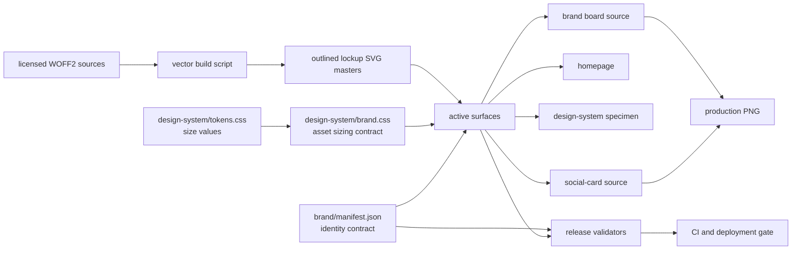

# Openly Useful Brand-System Architecture

Version: **3.0.1**

Status: production contract

## Requirements

### Functional

- Render the same institutional symbol, wordmark, and tagline treatment on the homepage, design-system specimen, brand board, social card, favicon, and footer.
- Support two compositions only: `stacked` for identity moments and `horizontal` for navigation/footer contexts.
- Support light and reverse color treatments without changing geometry or typography.
- Keep old public asset URLs working while preventing old visuals from remaining active.

### Non-functional

- Zero client-side JavaScript required for identity rendering.
- No third-party font request, tracking request, or runtime dependency.
- Deterministic identity rendering across operating systems through precomposed outlined SVG masters.
- Versioned asset URLs for cache safety.
- Automated failure when an active surface references a legacy asset or redefines the lockup.
- WCAG 2.2 AA-compatible semantics, contrast, reflow, and non-text alternatives.

### Constraints

- The site is a dependency-free static site deployed on Vercel.
- The approved O/U SVG geometry remains unchanged.
- The approved board remains the proportional source for the stacked lockup.

## High-level design



## Component boundaries

| Component | Owns | Must not own |
|---|---|---|
| `brand/manifest.json` | Canonical name, tagline, version, asset routes, allowed lockup contexts | Presentation CSS |
| `design-system/tokens.css` | Lockup sizes, interface typography, color, and spacing values | Internal logo composition |
| `design-system/brand.css` | Complete-asset sizing and accessibility utility | Logo typography or internal spacing |
| Versioned lockup SVGs | Symbol, wordmark, tagline, colors, proportions, and clear space | Surface layout |
| `scripts/build_brand_vectors.py` | Reproducible shaping and outlining from licensed font sources | Runtime identity rendering |
| Surface styles | Page composition around a complete lockup | Wordmark weight/tracking or internal lockup spacing |
| Validators | Contract enforcement and migration redirects | Visual design decisions |

## Public component contract

### Horizontal lockup

Use only for site headers and footers.

```html
<a href="/" aria-label="Openly Useful home">
  
</a>
```

### Stacked lockup

Use for the homepage hero, brand board, and social card. A consuming surface may select the documented `display`, `board`, or `social` scale, but may not restyle children.

```html
<h1 class="hero-lockup">
  <span class="ou-visually-hidden">Openly Useful</span>
  
</h1>
<p class="ou-visually-hidden">Useful things, openly made.</p>
```

## Data and build flow

1. A maintainer changes a licensed font source, source specification, mark, or composition rule.
2. `scripts/build_brand_vectors.py` shapes the canonical strings and freezes them as paths in the standalone and complete lockup SVGs.
3. Browser-rendered derivatives are regenerated from `brand/brandkit.html` and `brand/og-card.html`.
4. Geometry validation checks the O/U construction.
5. Brand-system validation proves that outlined assets contain no live text, every active surface uses a complete master, and historical routes redirect.
6. Site validation checks documents, responsive prerequisites, and production image dimensions.
7. CI blocks deployment if any contract fails; Vercel serves versioned assets and redirects historical URLs.

## Reliability and failure handling

- The visible identity has no font-loading state; each approved composition loads as one SVG image.
- Accessible names and canonical copy remain semantic HTML; the visual identity does not depend on a custom element, JavaScript, or hydration.
- Versioned filenames prevent a stale CDN or browser entry from mixing old and current lockups.
- Redirects preserve old links without allowing legacy files to remain canonical.
- Raster derivatives are validated for real PNG encoding and exact dimensions.

## Trade-offs

| Decision | Benefit | Cost |
|---|---|---|
| Complete outlined SVGs instead of live-text logo children | Exact same paths, spacing, and proportions at every surface; no font hinting or swap | Logo copy is not directly selectable and accessible text must be supplied separately |
| Shared CSS sizing contract instead of a JavaScript component | Works without JavaScript, renders immediately, simple static hosting | Markup is repeated and therefore must be validated |
| Self-hosted variable font sources | Reproducible outline generation and consistent interface typography; no third-party request | Adds font assets, licenses, and a small maintainer-only build dependency |
| Versioned asset filenames | Eliminates mixed-cache brand states | Asset updates require route and redirect changes |
| Two lockup compositions | Fits navigation and major identity moments without improvisation | Deliberately limits surface-level creative variation |
| Archived legacy files plus redirects | Preserves history and old links | Repository retains historical binary weight |

## Growth path

Revisit the static contract when three or more separately deployed Openly Useful products consume the system. At that point, publish `tokens.css`, `brand.css`, the manifest, outlined lockups, font-source licenses, and integrity hashes as a small package. Do not introduce a framework-specific component until multiple products actually need one; the HTML/CSS contract remains the portability baseline.
